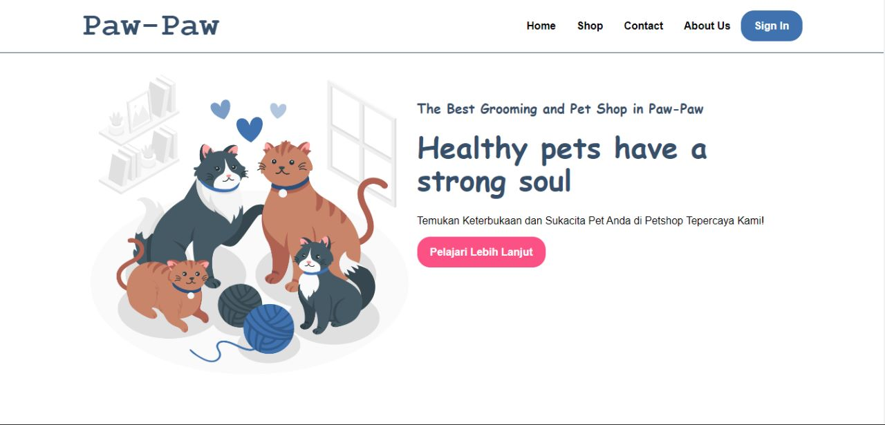
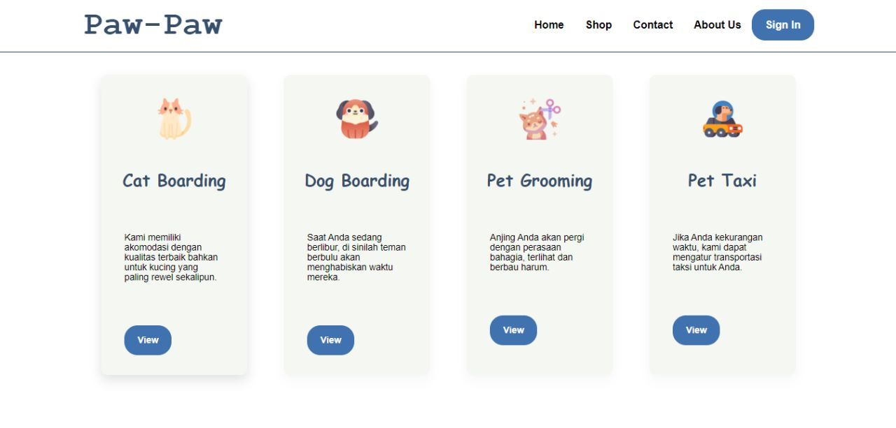
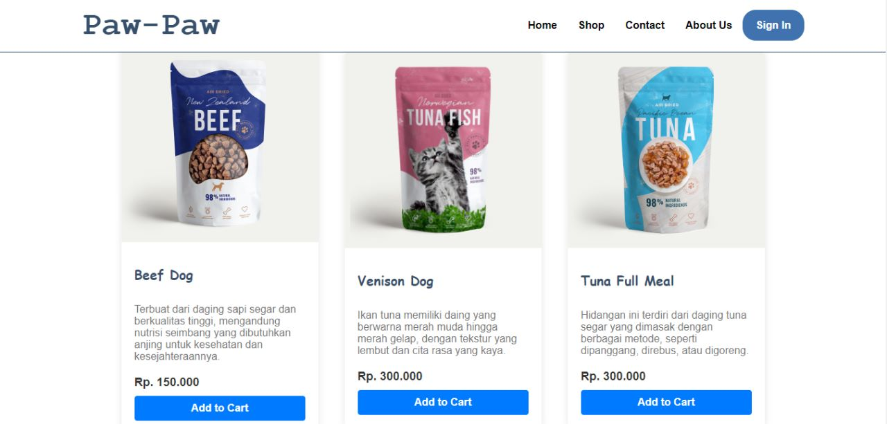
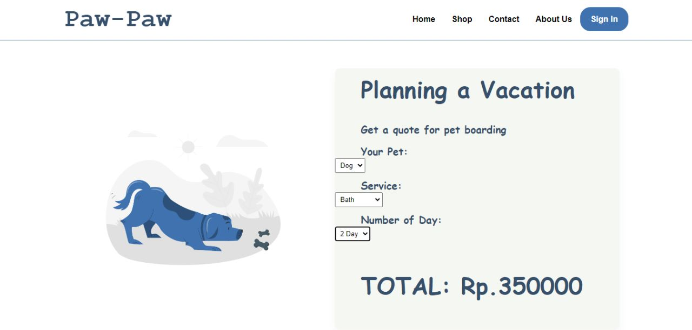
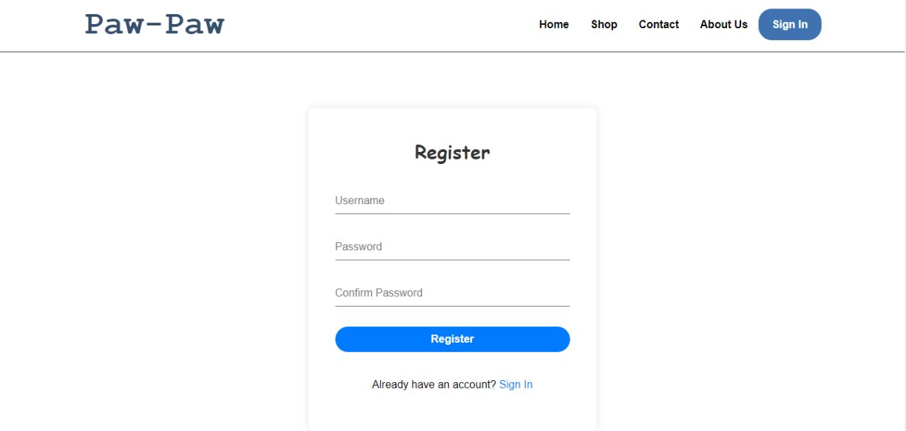
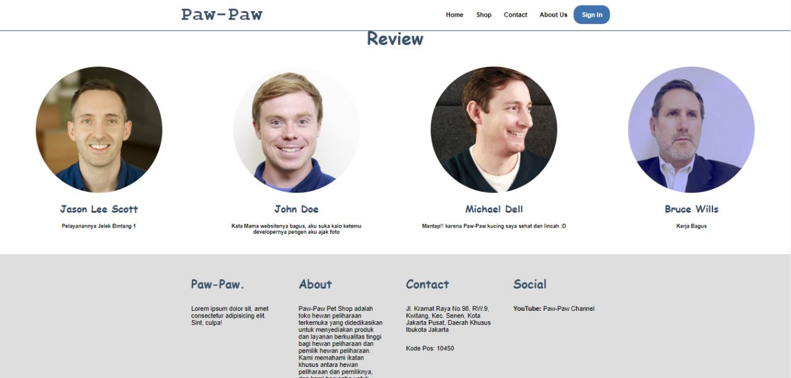
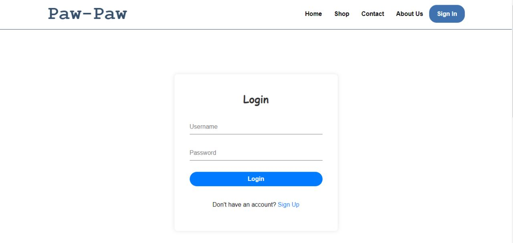

# Pet Shop 😺🐶

Paw-Paw adalah sebuah pet shop yang berkomitmen untuk menyediakan produk dan layanan berkualitas tinggi untuk hewan peliharaan dan pemilik hewan. Kami memahami ikatan khusus antara hewan peliharaan dan pemiliknya, dan kami berusaha untuk meningkatkan dan merawat ikatan tersebut melalui berbagai penawaran kami.

# Objektif 😀

1. Memberikan Layanan Pelanggan yang Unggul: Tujuan utama Paw-Paw adalah memberikan layanan pelanggan yang luar biasa. Kami berkomitmen untuk memberikan pengalaman belanja yang menyenangkan dan memuaskan bagi setiap pelanggan yang datang ke toko kami. Kami akan memberikan pelayanan yang ramah, pengetahuan yang mendalam tentang produk hewan peliharaan, dan solusi yang sesuai dengan kebutuhan unik setiap pelanggan.

2. Menyediakan Produk Berkualitas Tinggi: Paw-Paw berusaha untuk menyediakan produk hewan peliharaan yang berkualitas tinggi. Kami bekerja sama dengan produsen terpercaya yang memprioritaskan kualitas, keamanan, dan kesehatan hewan peliharaan. Kami akan terus memperbarui dan memperluas jajaran produk kami untuk memenuhi kebutuhan yang beragam dari pemilik hewan peliharaan.

3. Mendorong Kepemilikan Hewan yang Bertanggung Jawab: Paw-Paw berkomitmen untuk mempromosikan kepemilikan hewan yang bertanggung jawab. Kami akan menyediakan sumber daya dan informasi yang diperlukan untuk membantu pemilik hewan peliharaan dalam merawat dan memahami kebutuhan hewan mereka. Kami juga akan berperan aktif dalam mendukung kampanye kesadaran masyarakat mengenai adopsi hewan, sterilisasi, dan pentingnya perawatan yang baik bagi hewan peliharaan.

4. Membangun Komunitas Hewan Peliharaan yang Inklusif: Paw-Paw ingin menciptakan lingkungan yang ramah dan inklusif bagi semua pecinta hewan peliharaan. Kami akan mengadakan acara sosial dan edukatif yang melibatkan pemilik hewan peliharaan serta kerjasama dengan organisasi lokal yang berfokus pada kesejahteraan hewan. Kami ingin membangun komunitas yang saling mendukung dan berbagi pengetahuan serta pengalaman tentang perawatan hewan peliharaan.

5. Berkontribusi pada Kesejahteraan Hewan: Paw-Paw akan berperan aktif dalam mendukung kesejahteraan hewan secara keseluruhan. Kami akan menjalin kemitraan dengan lembaga penyelamatan hewan dan organisasi nirlaba untuk membantu hewan yang membutuhkan. Kami juga akan mendukung upaya perlindungan hewan dan memperjuangkan kebijakan yang memajukan kesejahteraan hewan secara luas.

Objektif ini menggambarkan komitmen Paw-Paw untuk memberikan layanan pelanggan yang unggul, menyediakan produk berkualitas tinggi, mendorong kepemilikan hewan yang bertanggung jawab, membangun komunitas yang inklusif, serta berkontribusi pada kesejahteraan hewan secara keseluruhan.

# Screen Shot 📷
* Tampilan Awal page

   

* Boarding page

   

* Product page

   

* Planing page

   

* Register page

   

* Review dan Footer page

   

* Login page

   
   
   
# How to Run?

1. Download Project ini

2. Downlaod XAMPP Control Panel V3.3.0 (rekomendasi) jika sudah ada skip saja

3. Extrak file project ke xampp/htdocs

4. Buka aplikasi XAMPP lalu jalankan *Apache* 

5. Buka Chrome ketik url : https://localhost/website-petshop/public/
